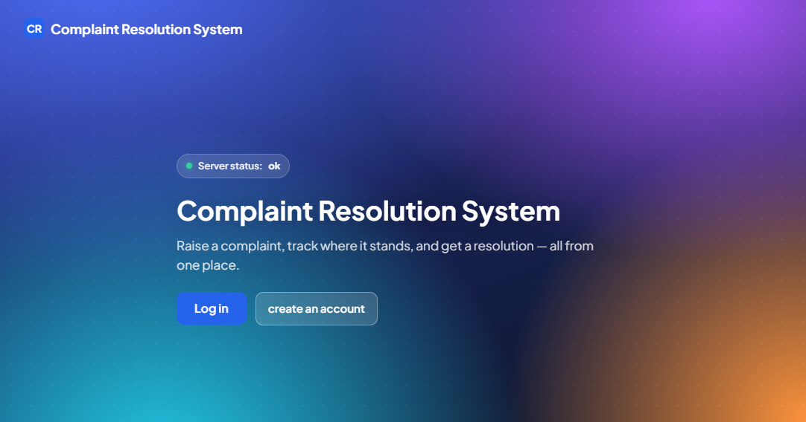
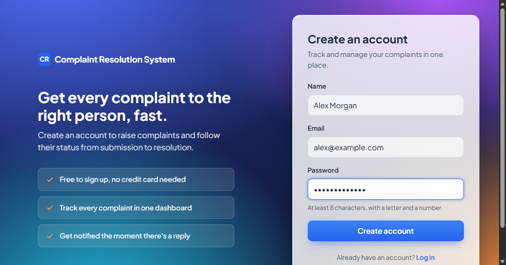
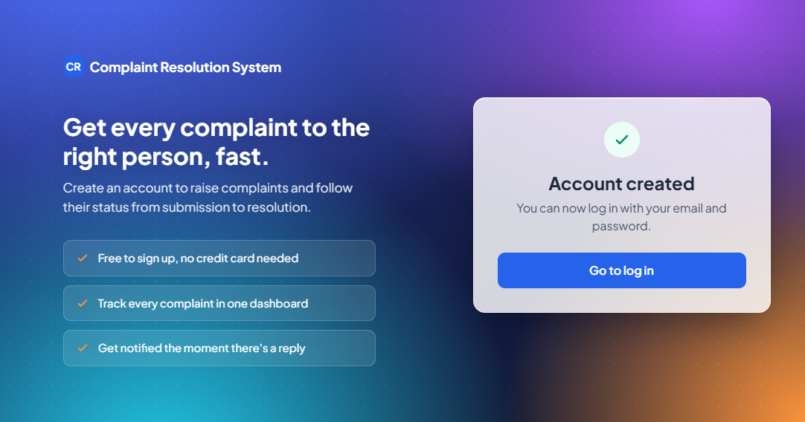
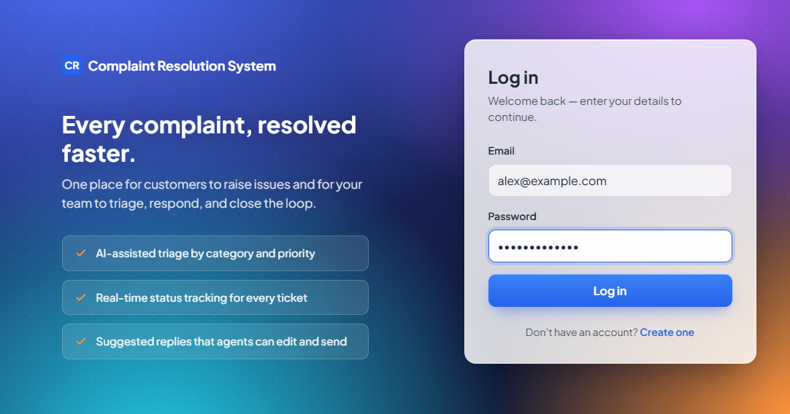
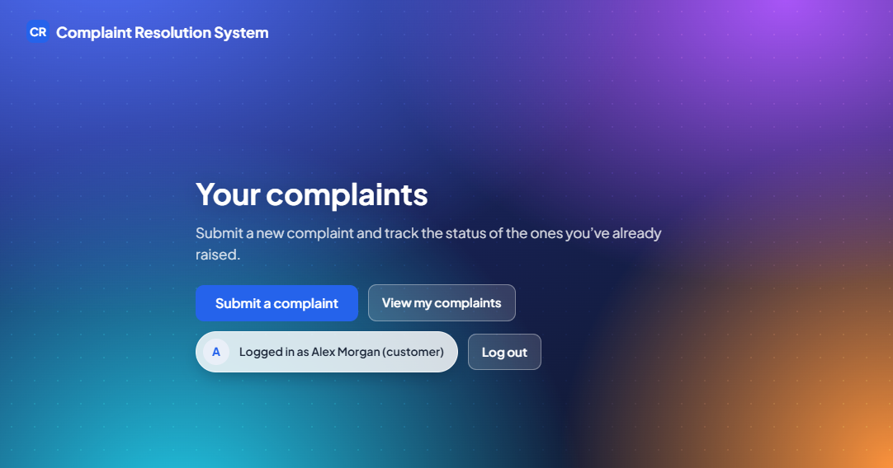
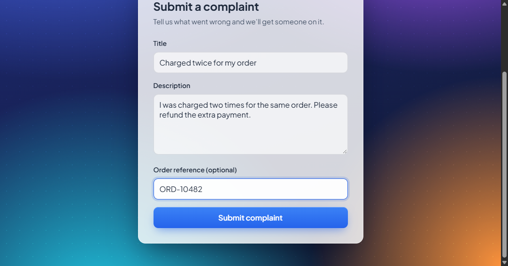
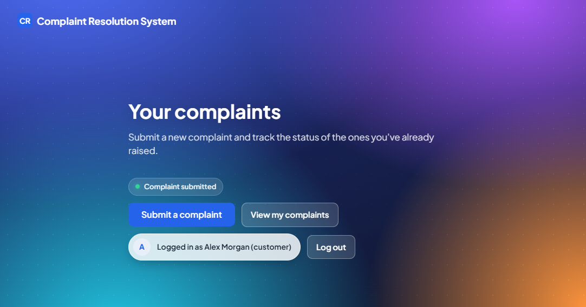
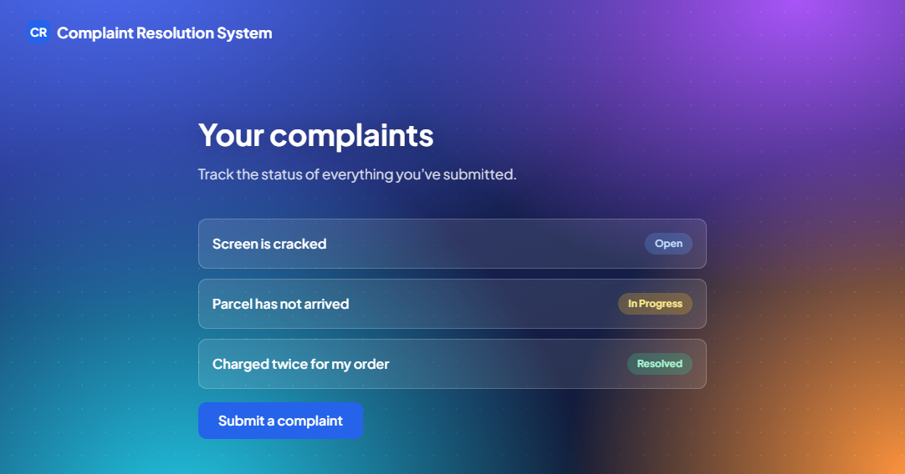
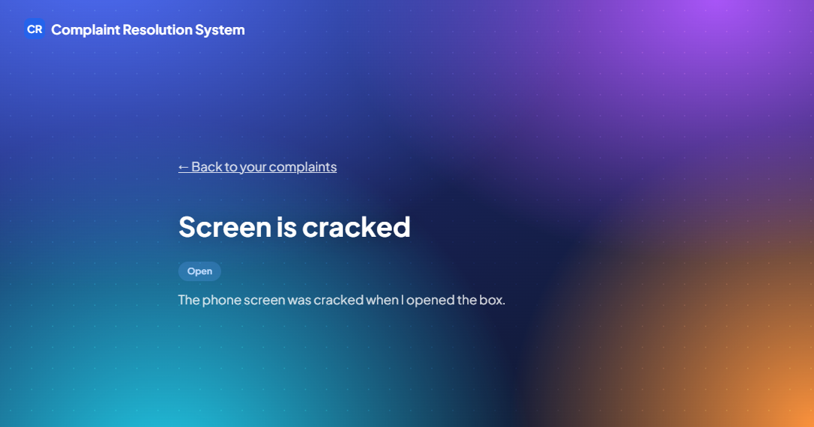
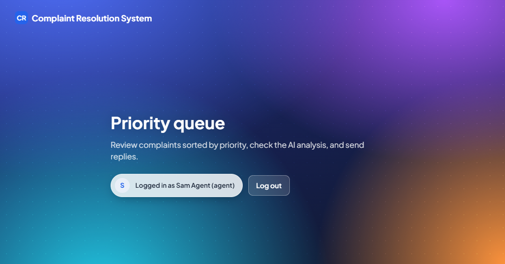

# User guide

How to use the Complaint Resolution System. There is one section for customers and one for agents.

**What is in this guide today:** everything a customer can do, and how an agent logs in. The agent screens for the priority queue, editing and sending replies, and resolving complaints are not in the app yet, so those steps are listed as "coming" at the end of the agent section. Add the steps and screenshots when each screen is built.

All screenshots were taken from the running app with made-up data.

## Customers

### 1. Create an account

1. Open the home page and select **create an account**.

   

2. Fill in the form and select **Create account**.

   - **Name:** 2 to 60 characters.
   - **Email:** a valid email address. Each email can be used for one account only.
   - **Password:** at least 8 characters, with at least one letter and one number.

   

3. When you see "Account created", select **Go to log in**.

   

### 2. Log in

1. Enter your email and password and select **Log in**.

   

2. You land on **Your complaints**. From here you can submit a complaint or view the ones you already sent.

   

Good to know:

- After 5 wrong passwords in a row the account is locked for 15 minutes. Wait and try again.
- Too many login attempts from one computer are also blocked for 15 minutes.
- You stay logged in for up to 7 days on the same browser. If you are asked to log in again, just log in.
- Select **Log out** when you use a shared computer.

### 3. Submit a complaint

1. Select **Submit a complaint**.
2. Fill in the form:

   - **Title:** 5 to 120 characters. A short summary, for example "Charged twice for my order".
   - **Description:** 10 to 2000 characters. Say what went wrong and what you want us to do.
   - **Order reference:** optional. Add it if you have one.

   

3. Select **Submit complaint**. You return to your home page and see "Complaint submitted".

   

If a field is wrong, a message appears under it. Fix it and submit again.

Please do not write passwords, card numbers or other private details in a complaint.

### 4. Track your complaints

1. Select **View my complaints**. Your newest complaint is at the top.
2. Each complaint shows a status:

   | Status | Meaning |
   |---|---|
   | Open | We received it. No agent has started yet. |
   | In Progress | An agent is working on it. |
   | Resolved | The agent has finished. |

   

3. Select a complaint to see its title, status, description and order reference.

   

You can only see your own complaints.

## Agents

### 1. Log in

Agent accounts are not created on the sign-up page. That page always creates a customer account. Ask the project team for an agent account.

1. Open the log in page, enter your email and password, and select **Log in**.
2. You land on the **Priority queue** page. Select **Log out** when you finish.

   

A customer cannot open the agent page, and an agent cannot open the customer pages.

### 2. Work through the queue, reply and resolve (coming)

The server can already list open complaints sorted by priority (Urgent first) and let an agent change a complaint's status to Open, In Progress or Resolved. The screens that use them are not built yet:

- [ ] Priority queue list with filters
- [ ] Complaint page with the category, priority and suggested reply
- [ ] Edit and send a reply
- [ ] Mark a complaint Resolved

Add the step-by-step instructions and screenshots here when these screens are ready.

## Getting help

If something does not work, note what you did and what you saw, and report it to the project team. See [CONTRIBUTING.md](../CONTRIBUTING.md) for how the team tracks problems.
