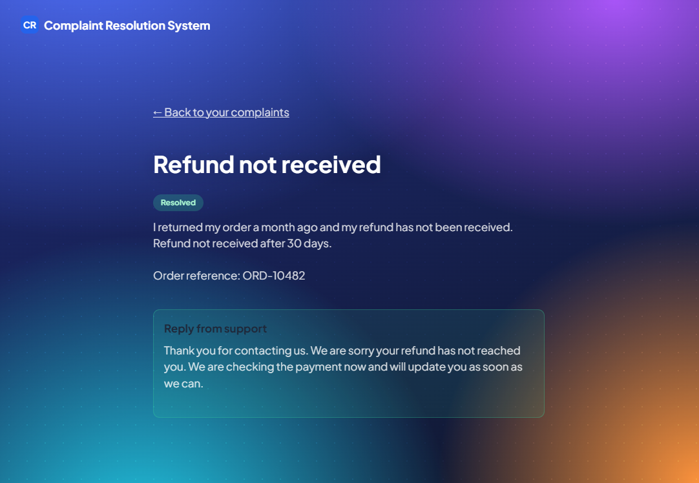
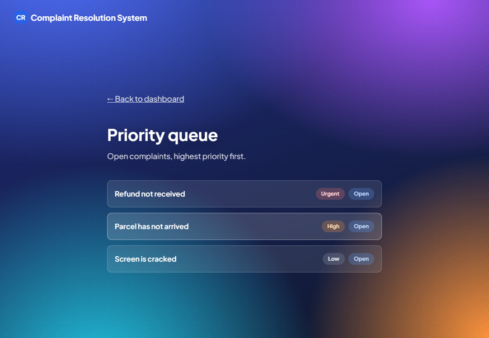
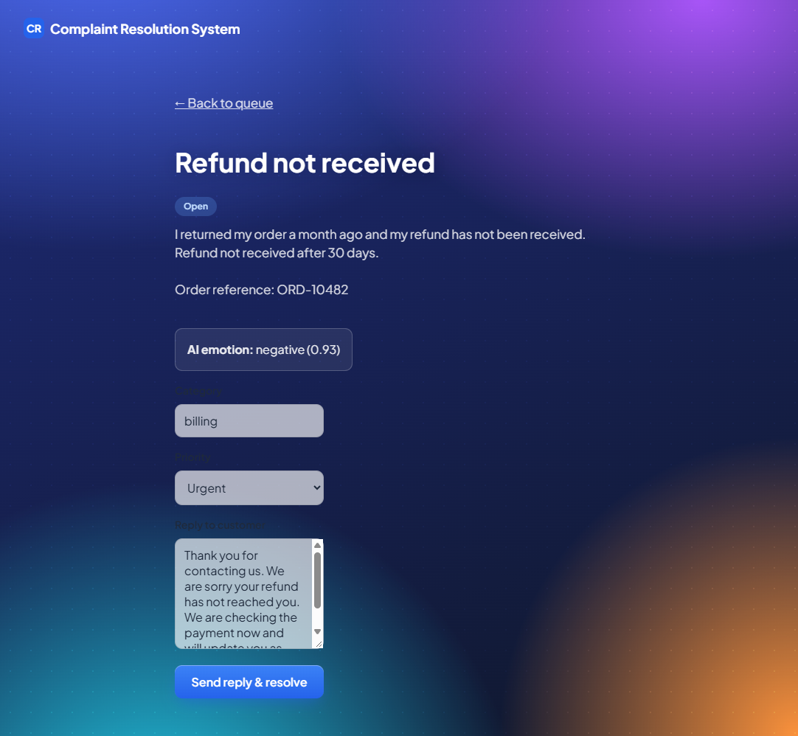
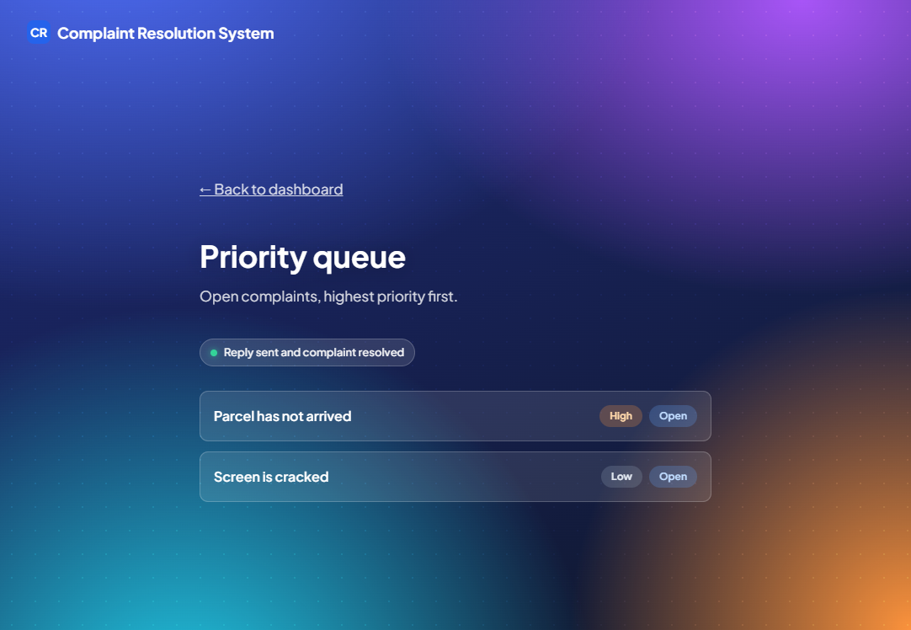

# User guide

How to use the Complaint Resolution System. There is one section for customers and one for agents.

New words are explained in the [glossary and FAQ](glossary-faq.md).

All screenshots were taken from the running app with made-up data. The category, priority and suggested reply shown in the agent screenshots came from a stand-in analysis service, so real results will differ.

## Customers

### 1. Create an account

1. Open the home page and select **create an account**.

   

2. Fill in the form and select **Create account**.

   - **Name:** 2 to 60 characters.
   - **Email:** a valid email address. Each email can be used for one account only.
   - **Password:** at least 8 characters, with at least one letter and one number.

   

3. When you see "Account created", select **Go to log in**.

   

### 2. Log in

1. Enter your email and password and select **Log in**.

   

2. You land on **Your complaints**. From here you can submit a complaint or view the ones you already sent.

   

Good to know:

- After 5 wrong passwords in a row the account is locked for 15 minutes. Wait and try again.
- Too many login attempts from one computer are also blocked for 15 minutes.
- You stay logged in for up to 7 days on the same browser. If you are asked to log in again, just log in.
- Select **Log out** when you use a shared computer.

### 3. Submit a complaint

1. Select **Submit a complaint**.
2. Fill in the form:

   - **Title:** 5 to 120 characters. A short summary, for example "Charged twice for my order".
   - **Description:** 10 to 2000 characters. Say what went wrong and what you want us to do.
   - **Order reference:** optional. Add it if you have one.

   

3. Select **Submit complaint**. You return to your home page and see "Complaint submitted".

   

If a field is wrong, a message appears under it. Fix it and submit again.

Please do not write passwords, card numbers or other private details in a complaint.

### 4. Track your complaints

1. Select **View my complaints**. Your newest complaint is at the top.
2. Each complaint shows a status:

   | Status | Meaning |
   |---|---|
   | Open | We received it. No agent has started yet. |
   | In Progress | An agent is working on it. |
   | Resolved | The agent has finished. |

   

3. Select a complaint to see its title, status, description and order reference.

   

4. When an agent replies, the status changes to Resolved and the reply appears on the complaint's page under "Reply from support". The app does not send emails yet, so check the page.

   

You can only see your own complaints.

## Agents

### 1. Log in

Agent accounts are not created on the sign-up page. That page always creates a customer account. Ask the project team for an agent account.

1. Open the log in page, enter your email and password, and select **Log in**.
2. You land on the agent home page. Select **View priority queue**. Select **Log out** when you finish.

   

A customer cannot open the agent pages, and an agent cannot open the customer pages.

### 2. Work through the priority queue

The queue lists **open** complaints. The highest priority is first (Urgent, High, Medium, Low). Older complaints come before newer ones of the same priority. Each row shows the title, the priority and the status.

Select a complaint to open it.

### 3. Review, edit and send a reply

The complaint page shows the customer's text, the order reference and the automatic analysis (the sentiment, and the category and priority the system chose). The reply box is filled with a suggested reply.

1. Read the complaint and the suggested reply.
2. If the **Category** or **Priority** is wrong, change it. The system keeps the original values and marks the complaint as corrected.
3. Edit the **Reply to customer** so it fits the complaint. The suggested reply is only a draft and is never sent without you.
4. Select **Send reply & resolve**.

   

The complaint is marked Resolved and you return to the queue, which shows "Reply sent and complaint resolved". The customer sees your reply on their complaint page.

Good to know:

- If the analysis service was down when the complaint arrived, the page says "AI analysis is still pending". Read the complaint and write the reply yourself.
- The reply must be 1 to 2000 characters.
- A complaint that is already Resolved cannot be replied to again.
- Do not promise a refund or an outcome you cannot guarantee.

## Getting help

If a word is unclear, see the [glossary and FAQ](glossary-faq.md). If something does not work, note what you did and what you saw, and report it to the project team. See [CONTRIBUTING.md](../CONTRIBUTING.md) for how the team tracks problems.
